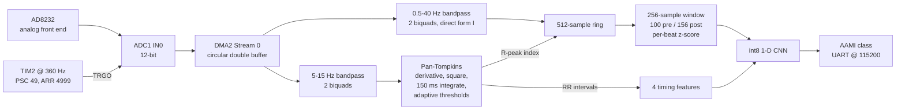
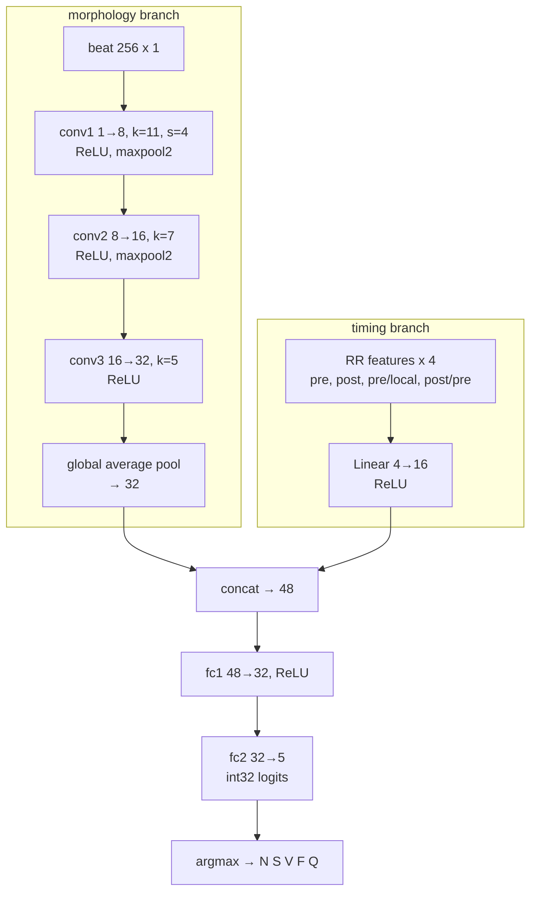

# Cardia

**Real-time ECG arrhythmia classification on a bare-metal Cortex-M4F.**

An AD8232 analog front end feeds an STM32F446RE sampling at exactly 360 Hz.
Register-level ADC + DMA double-buffering, cascaded IIR filters, Pan-Tompkins
QRS detection and an int8 convolutional network classify every heartbeat into
the five ANSI/AAMI EC57 classes. The whole image is **15.9 KB of flash and
15.8 KB of RAM**, with no vendor HAL, no RTOS and no dynamic allocation.

The classifier is evaluated under the **inter-patient protocol** — trained on 22
patients, tested on 22 *different* patients. That choice is the point of the
project, and it is why the headline accuracy below is 92.85% rather than the
99% that the same code reaches when patients are allowed to cross the split.

---

## Headline results

| Metric | Value | Protocol |
|---|---|---|
| **Beat classification accuracy** | **92.85%** | inter-patient, DS1→DS2, 49,691 held-out beats |
| Ventricular (V) sensitivity / PPV | 96.24% / 71.60% | inter-patient |
| Supraventricular (S) sensitivity / PPV | 20.25% / 35.26% | inter-patient |
| Normal (N) sensitivity / PPV | 96.45% / 96.30% | inter-patient |
| **QRS detection sensitivity** | **99.805%** | all 22 DS2 records, EC57 150 ms window |
| **QRS positive predictivity** | **98.353%** | all 22 DS2 records |
| **Firmware ↔ model agreement** | **50,374 / 50,374 beats bit-identical** | exact int32 equality, not a tolerance |
| Flash | 15,920 B (3.0% of 512 KB) | measured, `arm-none-eabi-size` |
| RAM | 15,840 B (12.1% of 128 KB) | measured, linker map |
| Model | 5,413 parameters, 6,188 B int8, 77,024 MACs/beat | measured |
| Inference latency | ~4.3 ms, ~1.4% CPU at 200 bpm | **estimated** — no board yet, see [RESULTS.md](docs/RESULTS.md) |

Full tables, confusion matrices and the measured-vs-estimated breakdown:
**[docs/RESULTS.md](docs/RESULTS.md)**.

---

## The one thing worth reading

Nearly every MIT-BIH arrhythmia project reports 98–99% accuracy. That number is
produced by pooling every beat from every patient, shuffling, and splitting
80/20 — which puts near-duplicate beats from the same patient on both sides of
the split. The model ends up recognising the *patient*, not the *arrhythmia*.

This repository trains that model too, deliberately, so the gap can be measured
rather than asserted. Same architecture, same schedule, same data:

| | Intra-patient<br>(random beat split) | **Inter-patient**<br>**(AAMI EC57)** |
|---|---|---|
| Patients in both train and test | 44 | **0** |
| Accuracy | 98.99% | **92.85%** |
| S sensitivity | 83.30% | **20.25%** |
| **F sensitivity** | **73.61%** | **0.00%** |

The fusion class is the clearest case. DS1 contains 414 fusion beats and **372
of them belong to a single patient**. With leakage the model memorises that one
patient and scores 74%; without it, having effectively seen one example of the
class, it scores zero. The intra-patient number is not a better model — it is
the same model answering an easier question.

---

## Architecture



Two bandpass filters run in parallel on the same stream because they have
opposite jobs: the 0.5–40 Hz path must **preserve** P/QRS/T morphology for the
classifier, while the 5–15 Hz path must **destroy** P and T so the QRS is the
only thing left for the detector to threshold.

### The network



Two branches because of physiology, not fashion. A supraventricular ectopic beat
is conducted down the normal His-Purkinje system, so its QRS looks *normal* —
what makes it ectopic is that it arrives **early**. A morphology-only model is
being asked to separate two classes that genuinely look alike. A ventricular
beat, by contrast, conducts cell-to-cell through myocardium and is wide and
bizarre, which morphology handles well.

---

## Quickstart

### Prerequisites

```bash
./scripts/setup-toolchain.sh
```

Installs the ARM GNU toolchain, CMake, Ninja and a Python virtualenv entirely
under `$HOME/.local` and the repo — **no root required**. See
[docs/TOOLCHAIN.md](docs/TOOLCHAIN.md) for the details, including the
Debian `ensurepip` workaround.

### ML track

```bash
make data      # download MIT-BIH from PhysioNet, build the DS1/DS2 caches
make train     # float -> BatchNorm fold -> int8 QAT
make export    # emit firmware/src/nn/cardia_model.{h,c}, verify the integer path
make eval      # inter-patient vs intra-patient comparison
```

### Firmware track

```bash
make test      # 27 host unit tests on the portable DSP and NN code
make sim       # build the host simulator from the firmware's own sources
make parity    # stream all of DS2 through the C chain, assert bit-exactness
make firmware  # cross-compile -> build/arm/cardia.elf, .bin, .map
make size      # flash/RAM breakdown
```

Flash the Nucleo by copying `build/arm/cardia.bin` to the `NODE_F446RE`
mass-storage device, or with OpenOCD.

---

## Verification: does the firmware run the model that was evaluated?

Three independent implementations of the same network exist in this repository:

1. **PyTorch, float with fake quantisation** — what training optimises.
2. **NumPy, pure integer** — independent of both PyTorch and C.
3. **C** (`firmware/src/nn/`) — what actually runs on the MCU.

(2) and (3) are written from one specification but share no code, so their
agreement is evidence rather than tautology. Streaming all 22 DS2 records
through the C chain and comparing the raw int32 logits against the NumPy
implementation gives:

```
C vs numpy integer reference: 50374/50374 beats bit-identical (100.0000%), 0 logit mismatches
```

**Exact equality on every beat, not agreement within a tolerance.** That
distinction earned its keep: an earlier run reported 12,322 of 12,323. The one
outlier came from the C kernel multiplying by a precomputed `1/scale` (VDIV
costs ~14 cycles on an M4F against 1 for VMUL) where the reference divided —
a last-bit float32 difference that landed one activation on the wrong side of a
rounding boundary. A tolerance-based test would have passed forever.

The same property is what makes the numbers transferable at all: everything
under `firmware/src/dsp/` and `firmware/src/nn/` is portable C with no MCU
dependency, so the simulator that produced the accuracy figures compiles the
*same translation units* the board does, with only the compiler changed.

A **hardware-in-the-loop** mode (`-DCARDIA_HIL_MODE=ON`) streams a MIT-BIH
record to the physical board over UART, so the device can be validated against
annotated ground truth before an electrode is ever attached.

---

## Repository map

```
cardia/
├── ml/                       Python: dataset, training, quantisation, codegen
│   ├── cardia/
│   │   ├── aami.py           MIT-BIH symbol → AAMI class mapping
│   │   ├── splits.py         de Chazal DS1/DS2 record lists (asserts disjointness)
│   │   ├── config.py         single source of truth for host/target constants
│   │   ├── preprocess.py     causal filtering, beat windowing, RR features
│   │   ├── dataset.py        PhysioNet download, lead selection, beat sets
│   │   ├── model.py          the 1-D CNN + timing branch
│   │   ├── quantize.py       hand-written int8 QAT and export
│   │   ├── int_reference.py  independent NumPy integer implementation
│   │   ├── codegen.py        weights → C arrays
│   │   ├── metrics.py        AAMI EC57 scoring
│   │   └── train.py          float → BN fold → QAT
│   └── scripts/              CLI entry points and code generators
├── firmware/
│   ├── src/dsp/              PORTABLE C — biquads, Pan-Tompkins, pipeline
│   ├── src/nn/               PORTABLE C — int8 kernels, inference, generated model
│   ├── src/drivers/          TARGET ONLY — rcc, gpio, tim, adc_dma, usart, dwt
│   ├── include/              hand-written STM32F446 register map (RM0390)
│   ├── linker/               STM32F446RETx_FLASH.ld
│   └── CMakeLists.txt
├── sim/                      host simulator + C/Python parity checker
├── tests/                    host unit tests, scipy-derived known-answer vectors
├── hardware/                 AD8232 wiring, BOM, safety rules, bring-up checklist
├── docs/
│   ├── ARCHITECTURE.md       design decisions and the alternatives rejected
│   ├── RESULTS.md            full metrics, confusion matrices, resource tables
│   └── TOOLCHAIN.md
└── scripts/setup-toolchain.sh
```

---

## Design decisions worth defending

Each of these had a real alternative; [docs/ARCHITECTURE.md](docs/ARCHITECTURE.md)
gives the full reasoning.

- **Bare-metal register-level drivers, no HAL, no RTOS.** One periodic DMA
  callback and one main-loop consumer; a scheduler would add context-switch
  cost, a stack per task and a class of priority bugs in exchange for nothing.
  The STM32Cube HAL alone is larger than this entire image.
- **360 Hz everywhere.** MIT-BIH's native rate, so there is no resampling stage
  anywhere and no Python-only step the firmware cannot reproduce. It also
  divides exactly: TIM2's clock is 90 MHz (APB1 /4 with the ×2 timer-clock
  rule — missing that doubling is a silent factor-of-two sample-rate bug) and
  90 MHz / 360 Hz = 250,000 = 50 × 5000.
- **Causal filtering only.** `sosfilt`, never `sosfiltfilt`. Zero-phase
  filtering needs the whole record and looks into the future; a great deal of
  published ECG code uses it and reports the results as if they were achievable
  online.
- **Direct form I biquads.** Four state words per section instead of two, but
  the 0.5 Hz high-pass has poles at radius ≈0.9939 and direct form II's shared
  summing node is numerically fragile at that Q in float32.
- **Hand-written int8 QAT instead of `torch.ao.quantization`.** The claim at the
  end is that the C produces the *same* answer as the model, and "same" should
  mean equality. That requires the Python side to use the identical arithmetic
  the C side uses — saturating doubling high multiply, rounding shift, the
  gemmlowp/CMSIS-NN scheme — which is 150 lines to write and awkward to coerce a
  general framework into.
- **The final layer keeps its int32 accumulators.** Requantising to int8 would
  quantise away the margin between the top two classes, which is the only thing
  argmax depends on. It is also why `fc2` uses a per-tensor weight scale: with
  per-channel scales the five logits would be in five different units.
- **Generated C arrays, not a `.tflite` interpreter.** An interpreter costs tens
  of kilobytes to walk a graph fixed at build time, and puts the weights in RAM.
- **`-ffp-contract=off` on both host and target.** Stops the compiler fusing
  multiply-add into a single FMA with one rounding step. Faster and more
  accurate — and it would break bit-exact parity. Determinism wins here.

---

## Limitations

Stated plainly; the full list is in [RESULTS.md §7](docs/RESULTS.md).

- **S-class sensitivity is 20.25%** — the weakest real result. Single lead, only
  four causal RR features where the literature uses record-wide statistics, and
  75% of DS2's S beats come from one sick-sinus patient whose baseline rhythm is
  unlike anything in the training set.
- **F and Q sensitivity are 0%.** DS1 has 414 fusion beats (90% from one
  patient) and 8 unclassifiable beats. There is not enough patient-diverse data
  to learn either class; this is best described as an N/S/V classifier that
  reports F and Q for completeness.
- **V positive predictivity is 71.6%** — the model over-calls V on
  bundle-branch-block beats, which are wide but normal.
- **Inference latency is estimated, not measured.** No board was available; the
  DWT harness is implemented and ready.
- **One beat (~0.8 s) of classification latency**, inherent to using post-RR
  features.
- **No analog front end connected yet.** Everything is validated on MIT-BIH.

**Not a medical device.** No clinical validation, no patient isolation, no
certification. Battery or isolated power only. See
[hardware/README.md](hardware/README.md).

---

## References

1. Pan J, Tompkins WJ. *A Real-Time QRS Detection Algorithm.* IEEE Trans Biomed
   Eng, BME-32(3):230–236, 1985.
2. de Chazal P, O'Dwyer M, Reilly RB. *Automatic Classification of Heartbeats
   Using ECG Morphology and Heartbeat Interval Features.* IEEE Trans Biomed Eng,
   51(7):1196–1206, 2004. — the DS1/DS2 inter-patient protocol.
3. Moody GB, Mark RG. *The Impact of the MIT-BIH Arrhythmia Database.* IEEE Eng
   Med Biol, 20(3):45–50, 2001.
4. ANSI/AAMI EC57:2012. *Testing and Reporting Performance Results of Cardiac
   Rhythm and ST Segment Measurement Algorithms.*
5. Goldberger AL et al. *PhysioBank, PhysioToolkit, and PhysioNet.* Circulation
   101(23):e215–e220, 2000.
6. Jacob B et al. *Quantization and Training of Neural Networks for Efficient
   Integer-Arithmetic-Only Inference.* CVPR 2018.
7. Lai L, Suda N, Chandra V. *CMSIS-NN: Efficient Neural Network Kernels for Arm
   Cortex-M CPUs.* arXiv:1801.06601, 2018.
8. STMicroelectronics RM0390, *STM32F446xx reference manual*; ARM PM0214,
   *Cortex-M4 devices generic user guide*.

## License

MIT — see [LICENSE](LICENSE).
